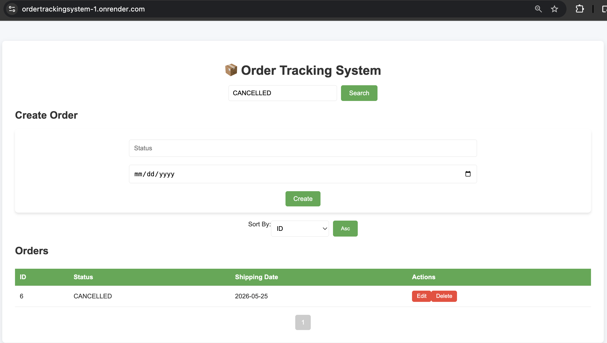

---

# 📦 Order Tracking System

## 🚀 Live Demo

🔗 **Frontend (React UI)**
[https://ordertrackingsystem-1.onrender.com](https://ordertrackingsystem-1.onrender.com)

🔗 **Backend API**
[https://ordertrackingsystem.onrender.com/api/orders](https://ordertrackingsystem.onrender.com/api/orders)

---

## 🌐 Project Type

Full-stack cloud-deployed CRUD system (production-style project)

A modern order management system built using **Spring Boot (Java)** for the backend and **React** for the frontend, integrated with a **PostgreSQL cloud database (Render)**.

This project demonstrates real-world software engineering practices including REST API design, layered architecture, and full-stack deployment.

---

## 🏆 Summary

This application showcases a complete full-stack system deployed on cloud infrastructure:

* Backend handles business logic and REST APIs
* Frontend provides interactive UI for users
* Database stores persistent order data in PostgreSQL

---

## 🧠 Architecture

```
React Frontend (Render Static Site)
        ↓
Spring Boot Backend (Render Web Service)
        ↓
PostgreSQL Database (Render Cloud Instance)
```

✔ REST API communication
✔ Stateless backend design
✔ Cloud-based deployment

---

## 🚀 Features

* Create, update, delete orders (CRUD operations)
* Search orders by status
* Pagination & sorting functionality
* RESTful API integration
* Fully responsive React UI
* Cloud-hosted PostgreSQL database
* End-to-end deployed full-stack system

---

## 📸 Screenshots

> Make sure these files exist in your repo:
> `screenshots/dashboard.png`
> `screenshots/search.png`

### 📊 Dashboard View


### 🔎 Search Orders Feature



---

## ⚙️ Tech Stack

### Backend

⚙️ Tech Stack
Backend Java 22 Spring Boot 3.4.4 Spring Data JPA Hibernate Maven PostgreSQL Driver

### Frontend

* React
* JavaScript (ES6+)
* CSS

### Deployment

* Render (Backend + Frontend + Database)

---

## 🧩 Key Highlights

* Clean layered architecture (Controller → Service → Repository)
* REST API best practices
* Pagination and filtering system
* Production-style cloud deployment
* Full-stack integration (React + Spring Boot + PostgreSQL)

---

## ▶️ Run Locally (Optional)

```bash
git clone https://github.com/mollanegash/ordertrackingsystem.git
cd ordertrackingsystem
./mvnw spring-boot:run
```

---
