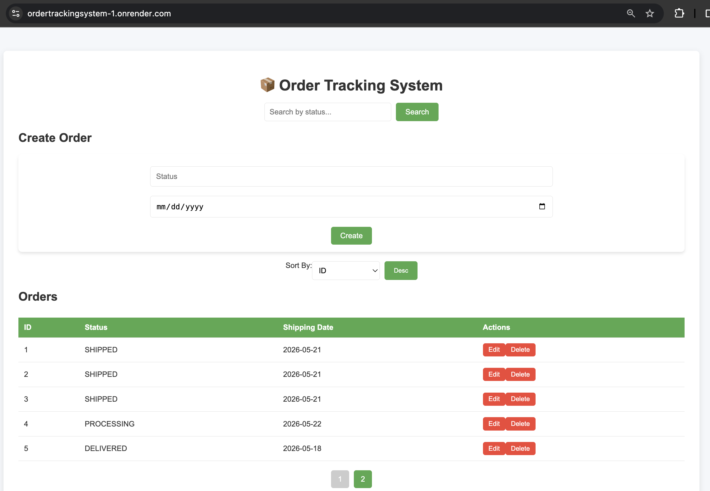

# 📦 Order Tracking System

## 🚀 Live Demo

🔗 Frontend (React UI)  
https://ordertrackingsystem-1.onrender.com

🔗 Backend API  
https://ordertrackingsystem.onrender.com/api/orders

---

## 🌐 Project Type

Full-stack cloud deployed CRUD system (Production-style demo)

A full-stack order management system built with **Spring Boot (Java)** and **React**.

This project demonstrates enterprise-style backend architecture, REST API design, and modern frontend integration.

---

## 🏆 Summary

This project is a full-stack cloud-deployed application demonstrating real-world software engineering practices using React, Spring Boot, and PostgreSQL.

---

## 🚀 Features

- Create, update, delete orders (CRUD)
- Search orders by status
- Pagination & sorting
- REST API integration
- React live UI connected to backend
- PostgreSQL persistent cloud database
- Deployed full-stack application (Render)

---

## 🧠 Architecture

React Frontend (Render Static Site)  
↓  
Spring Boot Backend (Render Web Service)  
↓  
PostgreSQL Database (Render Cloud)

---

## 📸 Screenshots

### Dashboard


### Create Order


---

## ⚙️ Tech Stack

**Backend**
- Java 17
- Spring Boot 3
- Spring Data JPA
- Maven

**Frontend**
- React
- JavaScript
- CSS

---

## 🧩 Key Highlights

- Clean layered architecture
- REST API best practices
- Pagination & filtering system
- Scalable backend design
- Production-style project structure

---

## ▶️ Run Locally (Optional)

For developers who want to run the project locally:

```bash
git clone https://github.com/mollanegash/ordertrackingsystem.git
cd ordertrackingsystem
./mvnw spring-boot:run
